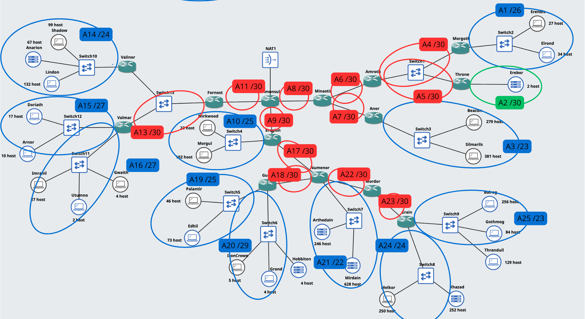
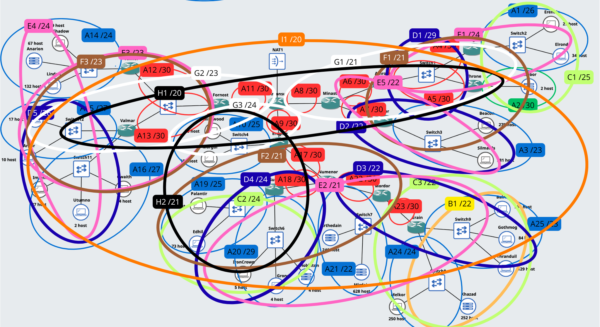
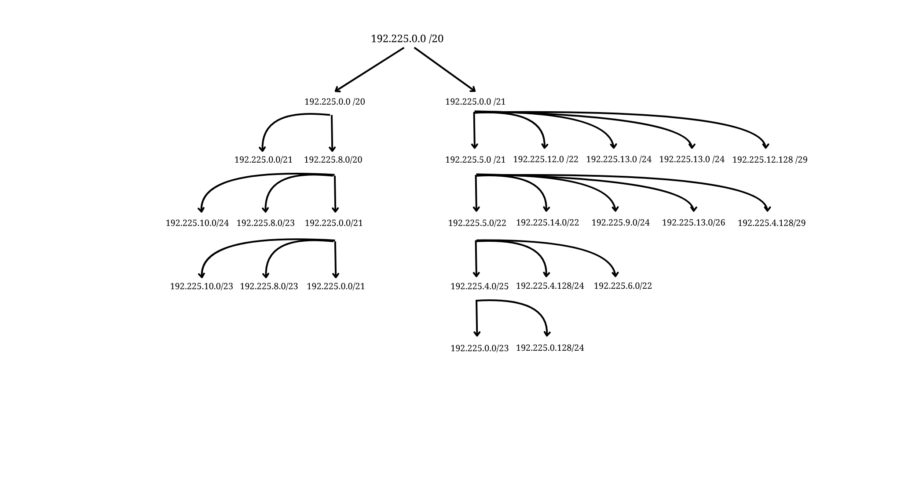

# Jarkom-Modul-4-2025-K-28

| No  | Nama                   | NRP        |
| --- | ---------------------- | ---------- |
| 1   | Aslam Ahmad Usman      | 5027241074 |
| 2   | Zahra Hafizhah         | 5027241121 |

# CIDR (Classless Inter-Domain Routing) - GNS3

## Tabel Rute Subnet

| Nama Subnet | Rute                                                                                           | Jumlah IP | Netmask |
|-------------|------------------------------------------------------------------------------------------------|-----------|---------|
| A1          | Morgoth > Switch2 > Erendis > Switch2 > Erlond                                                 | 61        | /27     |
| A2          | Throne > Erebor                                                                                | 2         | /30     |
| A3          | Anor > Switch3 > Silmarils > Switch3 > Beacon                                                  | 660       | /23     |
| A4          | Eregion > Switch4 > Mirkwood > Switch4 > Morgul                                                | 23        | /27     |
| A5          | Gudur > Switch5 > Palantir                                                                     | 46        | /27     |
| A6          | Numenor > Switch6 > IronCrown > Switch6 > Grond > Switch6 > Hobbiton                           | 13        | /28     |
| A7          | Erain > Switch7 > Arthedain                                                                    | 874       | /22     |
| A8          | Erain > Switch8 > Melkor > Switch8 > Khazad                                                    | 502       | /23     |
| A9          | Erain > Switch9 > Balrog > Switch9 > Gothmog > Switch9 > Thranduil                             | 469       | /24     |
| A10         | Valinor > Switch10 > Shadow > Switch10 > Anarion > Switch10 > Lindon                           | 298       | /25     |
| A11         | Valmar > Switch11 > Imrahil > Switch11 > Utumno > Switch11 > Gwaith                            | 33        | /27     |
| A12         | Valmar > Switch12 > Doriath > Switch12 > Arnor                                                 | 27        | /28     |
| A13         | Amansul > Fornost                                                                              | 2         | /30     |
| A14         | Amansul > Eregion                                                                              | 2         | /30     |
| A15         | Amansul > Minastir                                                                             | 2         | /30     |
| A16         | Minastir > Amroth                                                                              | 2         | /30     |
| A17         | Minastir > Anor                                                                                | 2         | /30     |
| A18         | Amroth > Morgoth                                                                               | 2         | /30     |
| A19         | Amroth > Throne                                                                                | 2         | /30     |
| A20         | Fornost > Valinor                                                                              | 2         | /30     |
| A21         | Fornost > Valmar                                                                               | 2         | /30     |
| A22         | Eregion > Numenor                                                                              | 2         | /30     |
| A23         | Eregion > Gudur                                                                                | 2         | /30     |
| A24         | Numenor > Mordor                                                                               | 2         | /30     |
| A25         | Mordor > Erain                                                                                 | 2         | /30     |
| **Total**   |                                                                                                | **3183**  | **/20** |

## Topologi

## Supernetting

Berikut hasil penggabungan subnet yang telah dilakukan.

## Tabel Supernetting

Berikut tabel yang menampilkan seluruh hasil gabungan subnet dari supernetting, mulai dari awal (B1 - /22) hingga akhir (I1 - /20). 

| Subnet Gabungan | Subnet 1 | Netmask 1 | Subnet 2 | Netmask 2 | Netmask Akhir |
|-----------------|----------|-----------|----------|-----------|---------------|
| B1              | A25      | /23       | A24      | /24       | /22           |
| C1              | A1       | /26       | A2       | /30       | /25           |
| C2              | A19      | /25       | A20      | /29       | /24           |
| C3              | B1       | /22       | A23      | /30       | /22           |
| D1              | A4       | /30       | A5       | /30       | /29           |
| D2              | A3       | /23       | A7       | /30       | /22           |
| D3              | B1       | /22       | A23      | /30       | /22           |
| D4              | C2       | /24       | A18      | /30       | /24           |
| D5              | A15      | /27       | A16      | /27       | /26           |
| E1              | un       | /25       | D1       | /29       | /24           |
| E2              | D3       | /22       | D4       | /24       | /21           |
| E3              | A12      | /30       | A13      | /30       | /29           |
| E4              | A14      | /24       | D5       | /26       | /24           |
| E5              | A6       | /30       | D2       | /22       | /22           |
| F1              | E1       | /24       | E5       | /22       | /21           |
| F2              | E2       | /21       | A17      | /30       | /21           |
| F3              | E3       | /29       | E4       | /24       | /23           |
| G1              | F1       | /21       | A8       | /30       | /21           |
| G2              | F3       | /23       | A11      | /30       | /23           |
| G3              | A10      | /25       | A9       | /30       | /24           |
| H1              | F2       | /21       | G3       | /24       | /21           |
| H2              | F1       | /21       | F3       | /23       | /20           |
| I1              | H1       | /21       | H2       | /20       | /20           |

## Tree CIDR

## Tabel Subnetting 

Prefix IP: 192.225

| Subnet | Network ID   | Netmask        | Broadcast      | Range IP                        |
|--------|--------------|----------------|----------------|---------------------------------|
| A7     | 192.225.0.0  | 255.255.252.0  | 192.225.3.255  | 192.225.0.1 - 192.225.3.254     |
| A3     | 192.225.4.0  | 255.255.254.0  | 192.225.5.255  | 192.225.4.1 - 192.225.5.254     |
| A9     | 192.225.6.0  | 255.255.255.0  | 192.225.6.255  | 192.225.6.1 - 192.225.6.254     |
| A8     | 192.225.7.0  | 255.255.255.0  | 192.225.7.255  | 192.225.7.1 - 192.225.7.254     |
| A10    | 192.225.8.0  | 255.255.255.128| 192.225.8.127  | 192.225.8.1 - 192.225.8.126     |
| A4     | 192.225.8.128| 255.255.255.128| 192.225.8.255  | 192.225.8.129 - 192.225.8.254   |
| A5     | 192.225.9.32 | 255.255.255.128| 192.225.9.159  | 192.225.9.33 - 192.225.9.158    |
| A1     | 192.225.9.64 | 255.255.255.224| 192.225.9.95   | 192.225.9.65 - 192.225.9.94     |
| A2     | 192.225.9.64 | 255.255.255.224| 192.225.9.95   | 192.225.9.65 - 192.225.9.94     |
| A11    | 192.225.9.128| 255.255.255.224| 192.225.9.159  | 192.225.9.129 - 192.225.9.158   |
| A12    | 192.225.9.192| 255.255.255.240| 192.225.9.207  | 192.225.9.193 - 192.225.9.206   |
| A6     | 192.225.9.208| 255.255.255.224| 192.225.9.223  | 192.225.9.209 - 192.225.9.222   |
| A13    | 192.225.10.0 | 255.255.255.252| 192.225.10.3   | 192.225.10.1 - 192.225.10.2     |
| A14    | 192.225.10.4 | 255.255.255.252| 192.225.10.7   | 192.225.10.5 - 192.225.10.6     |
| A15    | 192.225.10.8 | 255.255.255.252| 192.225.10.11  | 192.225.10.9 - 192.225.10.10    |
| A16    | 192.225.10.12| 255.255.255.240| 192.225.10.15  | 192.225.10.13 - 192.225.10.14   |
| A17    | 192.225.10.16| 255.255.255.240| 192.225.10.19  | 192.225.10.17 - 192.225.10.18   |
| A18    | 192.225.10.20| 255.255.255.128| 192.225.10.23  | 192.225.10.21 - 192.225.10.22   |
| A19    | 192.225.10.24| 255.255.255.128| 192.225.10.27  | 192.225.10.25 - 192.225.10.26   |
| A20    | 192.225.10.28| 255.255.255.128| 192.225.10.31  | 192.225.10.29 - 192.225.10.30   |
| A21    | 192.225.10.32| 255.255.255.128| 192.225.10.35  | 192.225.10.33 - 192.225.10.34   |
| A22    | 192.225.10.36| 255.255.255.128| 192.225.10.39  | 192.225.10.37 - 192.225.10.38   |
| A23    | 192.225.10.40| 255.255.255.128| 192.225.10.43  | 192.225.10.41 - 192.225.10.42   |
| A24    | 192.225.10.44| 255.255.255.128| 192.225.10.47  | 192.225.10.45 - 192.225.10.46   |
| A25    | 192.225.10.48| 255.255.255.128| 192.225.10.51  | 192.225.10.49 - 192.225.10.50   |

